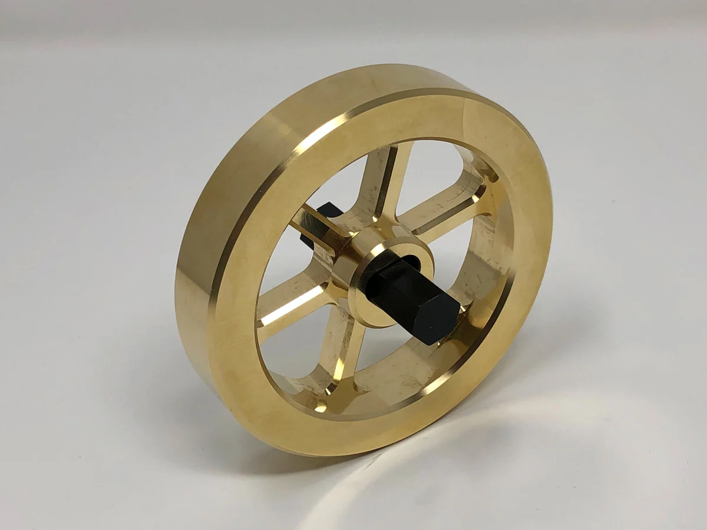

# Physics

Merely the name of it strikes fear in the hearts of students. Despite how bad it may seem, 
physics is still extremely important in understanding the laws that govern how your robot moves.
Whether you want to do physics simulation for a subsystem or get an idea of what the optimal performance 
for your robot looks like, physics is essential to know and get at least a tiny grasp on. 

This document assumes you have basic understanding of SI prefixes and unit symbols.

# TODO: add pictures
# Fundamental Units
Doesn't cover everything possible, but this is most of what will be useful in FRC.

Please standardize on SI.
## The ones you already know
You should know most of these already, but a refresher is always helpful.
### Time
- #### Symbol: $t$
- #### SI Unit: seconds ($s$)
- #### Other Units: milliseconds ($ms$)
look at ur clock idk

### Distance
- #### Symbol: $d$
- #### SI Unit: meters ($m$)
- #### Other Units: inches ($in$), centimeters ($cm$), feet ($ft$)
Linear distance between two points of interest.

### Mass
- #### Symbol: $m$
- #### SI Unit: kilograms ($kg$)
- #### Other Units: pounds ($lb$)
Not the same as weight! Technically measures resistance to force.

### Velocity
- #### Symbol: $v$
- #### SI Unit: meters per second ($m/s$)
Distance traveled over time.

### Acceleration
- #### Symbol: $a$
- #### SI Unit: meters per second squared ($m/s^2$)
Velocity's change over time, as in meters per second, per second.
### Angle 

- #### Symbol: $\theta$ (theta)
- #### SI Unit: radians ($rad$)
- #### Other Units: degrees ($\degree$), rotations
This isn't really a unit? SI is weird. Pick one and stick with it.
Or use Rotation2d.

### Angular Velocity 
- #### Symbol: $\omega$ (omega)
- #### SI Unit: radians per second ($rad/s$)
Rotational analog of velocity, or how quickly an object revolves around an axis of rotation.

### Angular Acceleration
- #### Symbol: $\alpha$ (alpha)
- #### SI Unit: radians per second squared ($rad/s^2$)
Rotational analog of acceleration.

## The other ones
### Force
- #### Symbol: $F$ or $\stackrel{\rightarrow}{F}$
- #### SI Unit: newtons ($N$, $kg \cdot m/s^2$)
Force is, in essence, an influence on an object that causes it to accelerate. Newton's
2nd law states that the net force on an object is equal to its acceleration times mass
($F = ma$). For example, the same force will cause a $1kg$ object to accelerate 10 times
as fast as a $10kg$ object.

### Moment of Inertia
- #### Symbol: $I$
- #### SI Unit: kilogram meters squared ($kg \cdot m^2$)
Rotational analog of mass. The moment of inertia measures resistance to torque, or
how much torque is needed for a desired angular acceleration. Picture it as the sum
of mass times distance squared across the entire object. For example, if most of the
weight is concentrated near the center of rotation, the MOI will be lower than if a
majority of the mass was concentrated further away from the center of rotation, such
as in a flywheel.

 Note how most of the material is concentrated on the edge, in order to increase MOI.

### Torque
- #### Symbol: $\tau$ (tau)
- #### SI Unit: newton meters ($N \cdot m$)
Rotational analog of force. A torque can be thought of as a "twist" applied to an
object that causes it to angularly accelerate. Torque relates to angular acceleration
and MOI as force relates to linear acceleration and mass.

### Current
- #### Symbol: $I$ (why is this also $I$ please SI save me)
- #### SI Unit: ampères or amps ($A$)
Also called amperage, current is the flow of electrical charge through a space. 
If you imagine electricity as a bunch of tiny particles that move through a conductor, 
current measures their *rate of flow*. Currents create magnetic forces, which are 
used to drive motors.

### Voltage
- #### Symbol: $V$
- #### SI Unit: volts ($V$)
Comes in many names, such as electric potential, electric pressure, or
electric tension, but it's most commonly called voltage. Voltage is an extremely
complicated topic, but for our purposes, picture it as a pressure that "pushes"
current through a conductor.

### Resistance
- #### Symbol: $R$
- #### SI Unit: ohms ($\Omega$)
Electrical resistance measures the opposition to current flow. Conceptually,
electric resistance is very similar to mechanical friction. Essentially all objects
have some level of electrical resistance, the difference between an electrical
conductor and an insulator is simply how *much* resistance there is. Nominally, the
resistance in an FRC battery is about $20 m\Omega$.

### Ohm's Law
Unsurprisingly, the last 3 units are all directly related to each other. Essentially,
voltage induces current through a resistance. This is all neatly modeled via Ohm's law,
an equation that states:
$$I = V/R$$
where $I$ is current, $V$ is voltage, and $R$ is resistance. This equation can be represented
in many other ways, such as $V = IR$. Use the one that best suits your needs.

### Power
- #### Symbol: $P$
- #### SI Unit: watts ($W$)
Power is an amount of energy transferred or converted over time. Power appears in many
ways in different forms of energy. According to the 1st Law of Thermodynamics, power can 
neither be created nor destroyed, so in a closed system, Power in should equal Power out.

# Understanding DC Motors
Electric motors convert **electrical energy** into **mechanical energy**.
